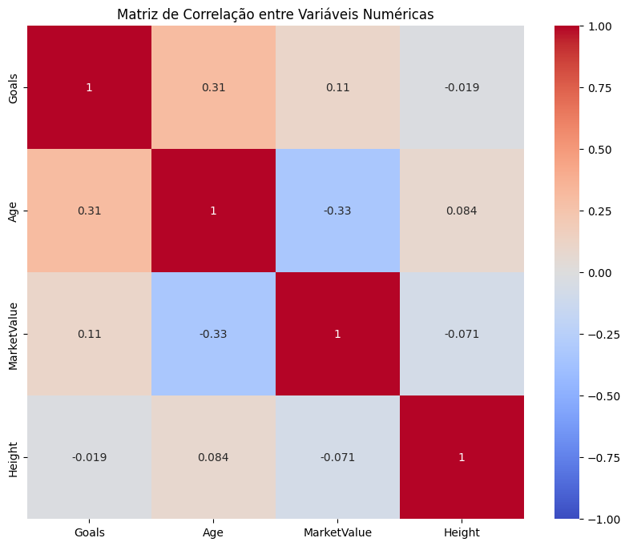
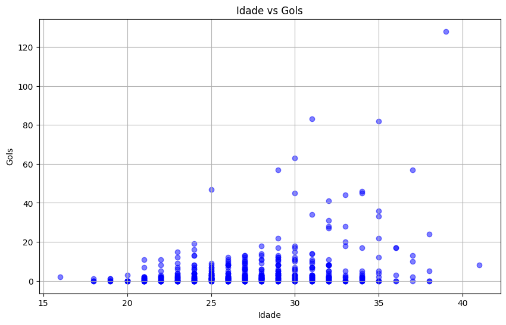

# Projeto Eurocopa 2024 em Python

Bem-vindo ao projeto de análise da Eurocopa 2024 em Python, onde exploramos dados fascinantes e insights profundos sobre os grandes astros do futebol europeu. Neste espaço, mergulhamos em estatísticas que revelam muito mais do que números; revelam histórias de habilidade, resiliência e determinação.

Começamos descobrindo os artilheiros que brilharam nos gramados europeus, liderados pelo lendário Cristiano Ronaldo, cujos 128 gols o posicionam como o indiscutível número 7 na história do futebol. Através de uma análise simples, destacamos os Top 10 artilheiros da Eurocopa 2024, revelando quem dominou a competição com sua precisão impressionante diante do gol.

Em seguida, adentramos na intrigante relação entre idade e desempenho, explorando uma matriz de correlação que revela insights valiosos. Descobrimos que a idade e os gols apresentam uma correlação positiva notável, indicando que jogadores mais experientes frequentemente acumulam uma história de conquistas e recordes ao longo de suas carreiras. Este insight não apenas ilumina o caminho para os jovens aspirantes, mas também celebra a durabilidade e o impacto duradouro de veteranos no esporte.

Por fim, através de um gráfico de dispersão, exploramos o tempo necessário para alcançar marcos significativos, como 50 gols pela seleção nacional. Observamos que muitos jogadores atingem esse feito entre as idades de 30 a 35 anos, um período crucial que desafia a resistência física e mental dos atletas. Em meio a essa análise, Cristiano Ronaldo surge como um exemplo vivo de superação de expectativas, continuando a elevar seu jogo mesmo próximo aos 40 anos, desafiando os limites convencionais e estabelecendo novos padrões de excelência.

Este projeto não é apenas uma jornada pelos números, mas uma celebração da paixão pelo futebol e da habilidade de Python para transformar dados em narrativas cativantes. Aproveite esta exploração e descubra como os dados podem contar as histórias mais inspiradoras do esporte.
